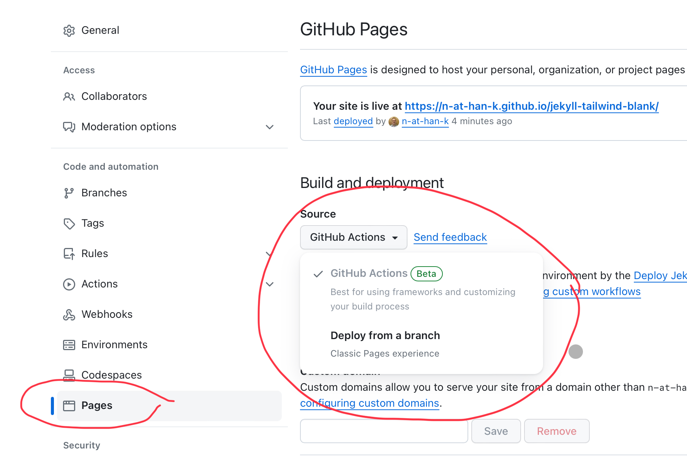

# jekyll-tailwind-stimulus

This is a barebones project to run jekyll with tailwind and stimulusjs on GitHub Pages.

## Usage
This repo is available as a GitHub template.

Click [use this template](https://github.com/new?template_name=jekyll-tailwind-stimulus&template_owner=n-at-han-k) at the top of the page to create a duplicate repo.

[](https://github.com/new?template_name=jekyll-tailwind-stimulus&template_owner=n-at-han-k)

Alternatively, just clone this repo and start adding your files.
```sh
git clone https://github.com/n-at-han-k/jekyll-tailwind-stimulus.git
```
## GitHub Pages
To deploy to GitHub pages you must set deployment source actions to "GitHub Actions", as seen below.

If you dont, then your workflow file WILL NOT WORK!
Don't ask me why, it's the only way, trust me.
If someone else has a suggestion then contact me.

